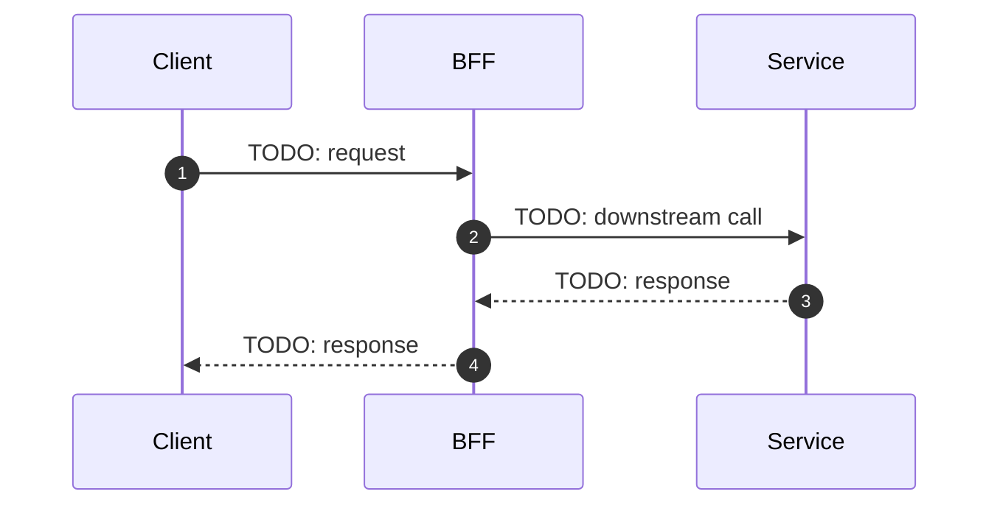

# RFC: {{title}}

Status: Draft
Source PRD: {{source}}
Requested Change Scope: {{scope}}

## Glossary

| Term | Definition |
| --- | --- |
| TODO | TODO: Add term definition. |

## Background

TODO: Summarize why this feature exists and what product outcome it should create. Cover what is being built, why, and why now.

## Product Requirements Summary

Source: {{source}}

{{prd}}

## Current State

TODO: Describe how the relevant parts of the system work TODAY — before any changes from this RFC. Cover which services are involved, the current user/data flow, what does NOT exist, and known limitations.

## Desired State

TODO: Describe what the system looks like AFTER this RFC is fully implemented. Focus on the delta from Current State. Cover what is new, what has changed, and what has been removed or replaced.

## In scope

- TODO: Brief summary of items covered as part of the solution.

## Out of scope

- TODO: Brief summary of items not covered as part of the solution.

## Solution

TODO: Describe the recommended implementation approach. Call out what we will be doing, what we will NOT be doing, and assumptions. Fold any repository / codebase findings here and into the per-story Technical Approach (cite file:line) — do not create a separate Repository Analysis or Implementation Context section.

## User Story: TODO-001 — [Story Title]

**As** [actor/role], **I want** [goal or capability], **so that** [business benefit].

### Acceptance Criteria

| AC | Given | When | Then |
| --- | --- | --- | --- |
| AC 1.1 | [Precondition] | [Trigger] | [Expected outcome] |
| AC 1.2 | [Precondition] | [Trigger] | [Expected outcome] |

### Technical Approach

> A single approach is the default. Only add an "Approach #2" block when there is a genuine alternative solution to weigh; otherwise keep one approach.

- TODO: Overview — describe how this story is implemented, citing concrete file:line references from the affected repositories.

- TODO: Database modelling (optional).
- TODO: APIs (optional).
- TODO: Events / Queue changes (optional).
- TODO: Pros / Cons (optional).

## Dependencies

TODO: List prerequisites/dependencies on any team/component before building/rollout.

## Task Breakdown

| ID | Title | Mandays | Type | Team |
| --- | --- | --- | --- | --- |
| 1 | TODO: backend task | 1 | Backend | TODO |
| 2 | TODO: frontend task | 2 | Frontend | TODO |
| 3 | TODO: QA task | 3 | QA | TODO |

## Cross-Cutting Checklist

| # | Concern | Status | Notes |
| --- | --- | --- | --- |
| 1 | **Non-Functional Requirements** — latency SLA, throughput, error rate targets | TODO | TODO |
| 2 | **Security** — authentication, authorisation, data access control | TODO | TODO |
| 3 | **Data Privacy / PII** — new PII fields, data masking, retention policy | TODO | TODO |
| 4 | **Compliance & Regulatory** — applicable regulations, licensing | TODO | TODO |
| 5 | **Risk & Fraud** — new attack surface, fraud rule changes, risk signal impact | TODO | TODO |
| 6 | **Customer Support (CS) Escalation** — new error codes, CS tooling, escalation playbook | TODO | TODO |
| 7 | **Backward Compatibility** — breaking API changes, client migration plan | TODO | TODO |
| 8 | **Feature Flag / Kill Switch** — mechanism to enable/disable safely without redeploy | TODO | TODO |
| 9 | **Observability** — new metrics, dashboards, log events, alerting rules | TODO | TODO |
| 10 | **Rate Limiting & Throttling** — abuse prevention, quota impact on new endpoints | TODO | TODO |
| 11 | **Third-party / External Dependencies** — vendor SLA, fallback if external system is down | TODO | TODO |
| 12 | **Testing Strategy** — unit, integration, E2E, regression, load testing coverage | TODO | TODO |

## Rollout Plan

TODO: Document how this change will be deployed to production safely. Cover feature flag name, rollout phases, targeting criteria, and monitoring gate per phase.

## Rollback Plan (Optional)

TODO: Document how to safely reverse this change. Cover immediate action, step-by-step, user-facing implications, data safety, and who to notify.

## Conclusion

TODO: Jot down the conclusion of the RFC review meeting discussion.

## References

- Links to reference docs
- Link to related PRD, RFCs
- Link to internal documents

## Open questions?

- [ ] Open question 1
  - Resolution for question 1
- [ ] Open question 2
  - Resolution for question 2

## RFC review meeting notes

| Date | Notes |
| --- | --- |
| TODO: date | **Attendees:** TODO: add attendees. **Meeting notes:** TODO: add notes. |
