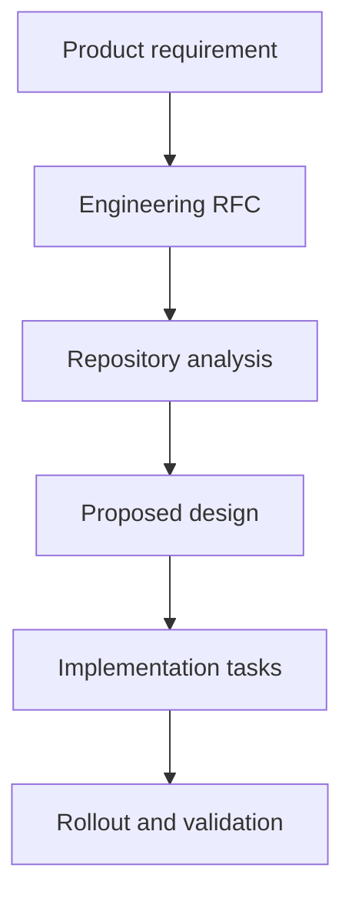

# RFC: {{title}}

Status: Draft
Source PRD: {{source}}
Requested Change Scope: {{scope}}

## Context

TODO: Summarize why this feature exists and what product outcome it should create.

## Implementation Context

{{context}}

## Goals

- TODO: Convert PRD goals into engineering-readable outcomes.

## Non-Goals

- TODO: List explicitly out-of-scope behavior.

## Product Requirements Summary

{{prd}}

## Repository Analysis

Analyze each user-specified repository before finalizing this RFC. Keep conclusions tied to inspected files, commits, or commands.

| Repository | Relevant Areas | Current Behavior | Required Change | Notes |
| --- | --- | --- | --- | --- |
| TODO | TODO: Link path or URL. | TODO: Summarize existing implementation. | TODO: Summarize RFC impact. | TODO: Add assumptions or blockers. |

## Change Impact Summary

- TODO: List cross-repository contracts, shared APIs, data dependencies, and rollout ordering.
- TODO: Call out backward-compatibility requirements and migration constraints.
- TODO: Identify owners or reviewers needed for each repository.

## Proposed Solution

TODO: Describe the recommended implementation approach.

## System Design

TODO: Capture services, data flow, sequence, and ownership boundaries.

## API Changes

TODO: For every impacted endpoint or outbound client, include the RFC contract:

- Method and path.
- Required and optional request headers.
- Query params.
- Request body schema or JSON example.
- Response body schema or JSON example.
- Error responses.
- Auth, idempotency, compatibility, and downstream side effects.

## Data Model Changes

TODO: List tables, fields, migrations, indexes, and backfill needs.

## Edge Cases

- TODO: Add behavior for empty states, retries, duplicate requests, partial failures, permissions, and stale data.

## Observability

- TODO: Define logs, metrics, dashboards, alerts, and audit trails.

## Rollout Plan

- TODO: Define feature flag, staged rollout, migration plan, and rollback path.

## Risks

- TODO: List product, technical, security, privacy, and operational risks.

## Open Questions

- TODO: Capture questions that must be resolved before implementation.

## Implementation Tasks

- [ ] TODO: Backend task.
  - Acceptance criteria: TODO.
- [ ] TODO: Frontend task.
  - Acceptance criteria: TODO.
- [ ] TODO: Data / analytics task.
  - Acceptance criteria: TODO.
- [ ] TODO: QA task.
  - Acceptance criteria: TODO.
- [ ] TODO: Release / rollout task.
  - Acceptance criteria: TODO.
